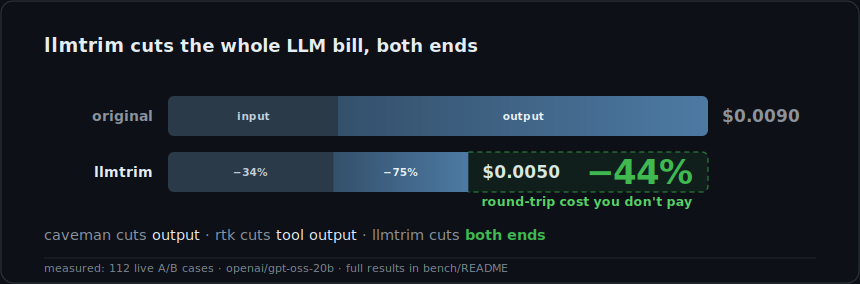

<p align="center">
  
</p>

<h1 align="center">llmtrim</h1>

<p align="center">
  <strong>llmtrim is a local proxy that compresses your LLM API requests so you pay less, with no change to the answers.</strong><br>
  It sits between your AI tools and the provider, strips the wasted tokens out of every request, and forwards it on. You get the same answers for a smaller bill.
</p>

<p align="center">
  <sub><b>−31% input and −74% output tokens</b>, measured live across 112 A/B cases, with no change in answer quality.</sub>
</p>

<p align="center">
  <a href="https://github.com/fkiene/llmtrim/actions/workflows/ci.yml"></a>
  <a href="LICENSE"></a>
  <a href="https://crates.io/crates/llmtrim"></a>
  
</p>

<p align="center">
  <a href="#what-it-actually-does">What it does</a> &bull;
  <a href="#see-it-on-real-output">See it in action</a> &bull;
  <a href="#get-started">Get started</a> &bull;
  <a href="#use-it-as-a-cli-or-library">CLI &amp; library</a> &bull;
  <a href="#works-with">Works with</a> &bull;
  <a href="#configuration">Configuration</a> &bull;
  <a href="#the-numbers">Numbers</a>
</p>

---

## What it actually does

You run Claude Code, Codex, Cursor, or your own app. Every time it talks to an LLM, it sends a big blob of text: your system prompt, the tool definitions, the whole conversation history, and the raw output of every command it ran. You pay for every one of those tokens, on every single turn.

**A lot of that text is waste.** A 200-line build log where only 2 lines are errors. A tool schema resent identically 50 times. A JSON array with 500 near-identical rows. The model doesn't need the bulk of it to answer well, but you're billed for all of it.

**llmtrim removes the waste before it's sent.** It installs as a local proxy that sits between your tool and the LLM provider. Requests pass through it, get compressed, and continue to the provider. The reply comes back unchanged. Your tool doesn't know it's there; you just get a smaller bill.

```
  before:  your tool ───── full request ─────▶  OpenAI / Anthropic / …
                    ◀──────── reply ──────────

  after:   your tool ──▶ llmtrim ──smaller──▶  OpenAI / Anthropic / …
                            (on your machine)
                    ◀──────── reply ──────────  (same answer)
```

> [!IMPORTANT]
> **It can never make your bill bigger or break a request.** Every compression step is re-measured with the provider's real tokenizer; if a step doesn't actually save tokens, it's reverted. If the provider rejects the compressed request, the original is resent verbatim. Worst case is zero savings, never a worse outcome.

Everything runs locally. Nothing is ever sent to us.

## See it on real output

Here's one real thing llmtrim does, end to end. An AI agent ran a build, and the `bash` tool returned a 58-line log. Only two lines matter (the errors), but all 58 get sent to the model and billed.

**Before**, what the model would receive (58 lines, 4,662 chars):

```text
[2026-06-13T10:02:00Z] INFO  compiling module core::worker::task_0 (incremental)
[2026-06-13T10:02:01Z] INFO  compiling module core::worker::task_1 (incremental)
[2026-06-13T10:02:02Z] INFO  compiling module core::worker::task_2 (incremental)
... 27 more near-identical INFO lines ...
[2026-06-13T10:02:31Z] ERROR src/worker/pool.rs:214: mismatched types: expected `usize`, found `i64`
... 25 more INFO lines ...
[2026-06-13T10:03:01Z] ERROR src/net/conn.rs:88: cannot borrow `buf` as mutable more than once
[2026-06-13T10:03:02Z] INFO  build failed, 2 errors
```

**After**, what llmtrim sends instead (5 lines, 978 chars, **−79%**):

```text
[{}] INFO compiling module core::worker::task_{} (incremental) [×30: (10:02:00Z..10:02:29Z step 1s; 0..29)]
[2026-06-13T10:02:31Z] ERROR src/worker/pool.rs:214: mismatched types: expected `usize`, found `i64`
[{}] INFO compiling module core::net::conn_{} (incremental) [×25: 10:02:32Z..10:02:56Z; 0..24]
[2026-06-13T10:03:01Z] ERROR src/net/conn.rs:88: cannot borrow `buf` as mutable more than once
[2026-06-13T10:03:02Z] INFO  build failed, 2 errors
```

Both errors and the summary survive **verbatim**. The repetitive INFO lines fold into a template plus their values, losslessly, because the range is regular (`task_0..task_29`). The model still sees exactly what happened; it just costs a fifth as much.

Try it yourself on any request body:

```bash
echo '{"model":"gpt-4o","messages":[...]}' | llmtrim compress --provider openai
```

Log-folding is just one of ten compressors. A different one re-encodes bulky JSON arrays into a compact table, with the same data in a third of the tokens:

```text
before:  [{"id":1,"city":"Paris","ok":true},{"id":2,"city":"Lyon","ok":false}, … 200 rows]
after:   [200]{id,city,ok}: 1,Paris,true; 2,Lyon,false; …          (TOON encoding, lossless)
```

Each compressor fires only where it pays:

| Where the waste is | What llmtrim does |
|---|---|
| **Tool output** (build logs, diffs, grep dumps, big JSON) | Keep the signal (errors, changes, matches), fold the noise |
| **Long context** (pasted docs, history) | Rank and keep the chunks relevant to the question; drop the rest |
| **Source code** | Keep the bodies of relevant functions, reduce the rest to signatures |
| **Tool schemas** (resent every turn) | Trim descriptions, drop unused tools, keep the cache prefix stable |
| **JSON / record arrays** | Re-encode to a compact table format, sample huge arrays |
| **The model's reply** | Ask for terser output where it won't hurt the answer |

<details>
<summary><b>Full stage reference (all 10 compressors)</b></summary>

Stages run in savings order. Nothing under a `cache_control` marker is ever rewritten.

| Stage | What it does | When it runs |
|---|---|---|
| **tool-output** | Lossless template fold first, then window logs · diffs · grep · dumps down to errors / changes / matches | tool results |
| **cache discipline** | Mark + stabilize the invariant prefix (sort tools/schema · OpenAI `prompt_cache_key`) so it stays cached | tools |
| **lexical retrieval** | BM25+ ranking with RM3 feedback · TextTiling topic cuts · budgeted non-redundant selection; question protected | long context |
| **skeletonization** | tree-sitter keeps relevant function bodies, drops the rest to signatures (14 languages) | code |
| **serialize + hygiene** | Minify JSON, encode record arrays to [TOON](https://crates.io/crates/toon-format) or CSV, Unicode-normalize | always · lossless |
| **json sample** | Down-sample huge record arrays: first/last + outliers + a query-biased diverse sample | big JSON |
| **dedup** | Collapse duplicate + near-duplicate lines (prose only) | always |
| **output control** | Terse instruction · Chain-of-Draft · token budget · native JSON schema | auto |
| **tool layer** | Static tool selection + description trimming | tools |
| **multimodal** | Downscale images to the provider's resolution cap | images |

Default `auto` switches each stage on only where it pays. `safe` runs the lossless stages only. [Full config →](#configuration)

</details>

## Get started

> [!NOTE]
> Works with any tool that routes through `HTTPS_PROXY`: Claude Code, Codex, Cursor, Aider, your own app. GitHub Copilot pins its certificates and can't be intercepted ([full list](#works-with)).

```bash
# 1. Install (any OS, prebuilt binary, no Rust needed)
npm install -g @llmtrim/cli && llmtrim setup

# 2. Open a new shell. Your AI tools now route through llmtrim automatically.

# 3. Watch the savings add up as you work
llmtrim status --watch
```

<p align="center">
  <picture>
    <source media="(prefers-color-scheme: light)" srcset="status-watch-light.svg">
    
  </picture>
</p>

**No Node?** Use an installer instead:

```bash
# Linux / macOS
curl -fsSL https://raw.githubusercontent.com/fkiene/llmtrim/main/install.sh | sh

# Windows (PowerShell)
irm https://raw.githubusercontent.com/fkiene/llmtrim/main/install.ps1 | iex
```

Or your own package manager, same binary everywhere: `brew install fkiene/tap/llmtrim` · `cargo binstall llmtrim` · `scoop install llmtrim` · `docker run ghcr.io/fkiene/llmtrim`. Full options in [INSTALL.md](INSTALL.md).

### Is this safe to install?

`setup` is a local HTTPS proxy, the same technique as [mitmproxy](https://mitmproxy.org), scoped to LLM APIs. It changes exactly three things (a CA certificate in `~/.llmtrim/`, a proxy setting in your shell profile, a login service), and `llmtrim uninstall` reverses all three. No API keys are stored (it forwards your tool's own auth), and your prompts never touch disk; only an anonymous count of tokens saved is kept. Full threat model: [SECURITY.md](SECURITY.md).

<details>
<summary><b>What gets installed, and how to verify the cert is harmless</b></summary>

1. **A private certificate** in `~/.llmtrim/`, cryptographically constrained to LLM API domains. It *cannot* read your bank, email, or any other traffic, even if the key were stolen. Check that yourself:
   ```bash
   llmtrim ca   # prints the cert path
   openssl x509 -in ~/.llmtrim/ca.pem -noout -text | grep -A3 "Name Constraints"
   # those domains are the only ones it can ever touch
   ```
2. **A proxy setting** in your shell profile (`HTTPS_PROXY` + `NODE_EXTRA_CA_CERTS`).
3. **A background service** that starts at login.

If the service stops, your tools fail fast with a connection error rather than silently bypassing it.

</details>

<details>
<summary><b>Day-to-day commands</b></summary>

```bash
llmtrim status      # health + savings dashboard (aliases: monitor, gain)
llmtrim doctor      # something off? end-to-end diagnosis; each check names its fix
llmtrim start       # start the background proxy
llmtrim stop        # stop it
llmtrim serve       # run in the foreground instead (Ctrl-C to quit)
llmtrim update      # update to the latest release + restart
llmtrim uninstall   # exact inverse of setup: removes all three changes
```

`llmtrim status --daily` (or `--weekly` / `--monthly`) gives a time-series report; add `--json` or `--csv` to export.

</details>

## Use it as a CLI or library

The same compression runs with no proxy and no setup, as a one-shot CLI, an embeddable Rust crate, or native bindings for **Python, Ruby, Swift and Kotlin**. No extra model calls, no network: the deterministic engine runs in your process.

| Language | Install |
|---|---|
| Rust | `cargo add llmtrim-core` |
| Python | `pip install llmtrim` |
| Ruby | `gem install llmtrim` |
| Kotlin | `implementation("io.github.fkiene:llmtrim:0.1.7")` (Maven Central) |
| Swift | `.package(url: "https://github.com/fkiene/llmtrim", from: "0.1.7")` (SwiftPM) |

> [!NOTE]
> The CLI is published today; the **library packages above ship with the next release**. Until then, build them from source: [`crates/llmtrim-uniffi`](crates/llmtrim-uniffi). *(This note is removed once they're published.)*

**CLI.** Pipe a request in, get a compressed one out:

```bash
echo '{"model":"gpt-4o","messages":[...]}' | llmtrim compress --provider openai > out.json
echo '{"model":"gpt-4o","messages":[...]}' | llmtrim send     --provider openai   # compress, call, print
```

**Rust.** The engine is the [`llmtrim-core`](https://crates.io/crates/llmtrim-core) crate (no `tokio`, no network in its dependency tree):

```rust
use llmtrim_core::{compress, compress_with_config, config::DenseConfig, ir::ProviderKind};

// None auto-detects the provider from the request shape.
let out = compress(request_json, Some(ProviderKind::OpenAi))?;
println!("{} -> {} input tokens", out.input_tokens_before, out.input_tokens_after);

// …or pass an explicit preset/config:
let out = compress_with_config(request_json, Some(ProviderKind::OpenAi), &DenseConfig::preset("agent").unwrap())?;
```

**Python / Ruby / Swift / Kotlin.** One flat `compress(input, provider, preset)` call, generated from the same Rust engine via [UniFFI](https://mozilla.github.io/uniffi-rs/). The compiled engine is bundled in each package, so there's no Rust toolchain to install:

```python
import llmtrim

out = llmtrim.compress(request_json, llmtrim.Provider.OPEN_AI, "aggressive")
print(out.input_tokens_before, "->", out.input_tokens_after)
```

> [!NOTE]
> Every binding returns the compressed `request_json` plus the before/after token counts, and maps errors to native exceptions. Per-language install and usage live in [`crates/llmtrim-uniffi`](crates/llmtrim-uniffi).

## Works with

Any tool that honors `HTTPS_PROXY` and an env-provided CA, which is essentially every CLI agent and most Node apps:

| Tool | Works | Notes |
|---|:---:|---|
| Claude Code | ✅ | Prompt-cache discount stays intact |
| Codex CLI | ✅ | |
| Gemini CLI | ✅ | |
| Cursor / VS Code extensions | ✅ | Node-based: picks up `NODE_EXTRA_CA_CERTS` |
| Aider, OpenCode, any `HTTPS_PROXY`-aware CLI | ✅ | |
| Your own app / SDK | ✅ | or call the [CLI / library](#use-it-as-a-cli-or-library) directly |
| GitHub Copilot | ❌ | certificate pinning blocks interception |

Providers come from the [`llm_providers`](https://crates.io/crates/llm_providers) registry (OpenAI, Anthropic, Google, DeepSeek, Mistral, xAI, Moonshot, Zhipu, Qwen, OpenRouter, …) and update with it. Every non-LLM connection passes through untouched.

## Configuration

**Zero config needed.** The default (`auto`) inspects each request and picks the right compressors for its shape: tool-heavy → `agent`, code → `code`, long context with a question → `rag`, otherwise → `aggressive`.

If you want to force a mode, set one line: `LLMTRIM_PRESET=<name>` or `preset = "<name>"` in `$XDG_CONFIG_HOME/llmtrim/config.toml`:

| preset | for |
| --- | --- |
| **`auto`** *(default)* | routes each request to the right compressors automatically; right for almost everyone |
| **`safe`** | lossless only: byte-faithful round-trip, no lossy stages |
| `reasoning` | math / step-by-step workloads |
| `cache` | a fixed prefix reused across many calls |

<details>
<summary><b>Per-flag overrides (power users)</b></summary>

Every stage is individually tunable via config flags; `preset` wins over individual flags. The full table is long; see the field list in [`src/config.rs`](src/config.rs) or run `llmtrim compress --help`. The most useful knobs:

| field | default | meaning |
| --- | --- | --- |
| `toolout` | on in `agent`/`aggressive` | tool-output compression (logs / diffs / grep / dumps) |
| `retrieve` | `false` | lexical retrieval for long context (lossy) |
| `skeletonize` | `false` | drop non-relevant function bodies to signatures |
| `serialize` | `true` | TOON / CSV encoding of record arrays |
| `json_crush` | on in `agent`/`aggressive` | sample huge record arrays |
| `output_control` | `false` | terse-output instruction + cap |
| `cache` | `false` | `cache_control` breakpoints (lossless) |
| `dedup` | `true` | collapse duplicate lines (lossless) |
| `quality_gate` | `true` | revert any lossy cut whose query-relevant coverage drops too far |

Env: `LLMTRIM_PRESET` (preset), `LLMTRIM_CONFIG` (config-file path), `LLMTRIM_DB_PATH` (ledger location).

</details>

## The numbers

The savings are measured live, not estimated. Each of 112 benchmark cases is sent **twice** (once original, once compressed), then both answers are scored and billed at real rates, so the saving and the answer quality are measured together.

<p align="center">
  <picture>
    <source media="(prefers-color-scheme: light)" srcset="bench/frontier-light.svg">
    
  </picture>
</p>

| | original | compressed | saved |
|---|--:|--:|--:|
| input tokens | 71,031 | 49,062 | **−31%** |
| output tokens | 25,843 | 6,628 | **−74%** |
| **round-trip cost** | **$0.0365** | **$0.0126** | **−66%** |
| answer quality | 78.9% | 82.2% | no measured degradation |

The token cuts are model-independent (−31% input, −74% output); the dollar saving depends on the model's output-to-input price ratio: −66% on the benchmark model, projected −57–59% at GPT-4o / Claude Sonnet rates. On live Claude Code traffic, llmtrim cuts **−68% of compressible input** without ever touching the cached prefix, so your prompt-cache discount stays intact.

Full methodology, per-corpus frontier, and confidence intervals are in [bench/README.md](bench/README.md). Reproduce it:

```bash
python3 bench/scripts/download.py 40   # pull real corpora (gsm8k, humaneval, dolly, hotpotqa, …)
bash    bench/scripts/run_all.sh       # live A/B (needs OPENROUTER_API_KEY)
python3 bench/scripts/chart.py         # regenerate the chart + table
```

<details>
<summary><b>How does it compare to RTK / Headroom / caveman?</b></summary>

Three neighbors each compress one layer of the problem; llmtrim does the whole round-trip and is quality-gated so it can't increase your bill.

| | **llmtrim** | Headroom | RTK | caveman |
|---|:---:|:---:|:---:|:---:|
| Whole round-trip (input · output · cache) | ✅ | input only | CLI only | output only |
| Can't increase your bill (auto-revert) | ✅ | ❌ | ✅ | ❌ |
| Live A/B: savings *and* quality | ✅ | offline | ❌ | tokens only |
| Install: one static binary | ✅ | Python + GB models | ✅ | ✅ |
| Overhead added / request | **<10 ms** | 52 ms median | <10 ms | n/a |
| Prompt overhead injected | **19 tokens** | n/a | n/a | 949 tokens |

They also **stack**: llmtrim removes another ~35% from Claude Code's resent tool schemas on top of RTK. Detailed head-to-heads with [RTK](https://github.com/rtk-ai/rtk), [Headroom](https://github.com/chopratejas/headroom), and [caveman](https://github.com/JuliusBrussee/caveman) are in [bench/README.md](bench/README.md).

</details>

## Known limits

These are surfaced by the same A/B that proves the savings:

- **Anthropic / Gemini token counts are approximate.** There's no public exact tokenizer, so a BPE proxy is used and flagged in `status`. OpenAI is exact.
- **Output savings aren't measured live.** The proxy compresses input; an output *saving* needs the A/B counterfactual, which only the offline benchmark runs. `status` "saved" is input-side.
- **The default is quality-gated, not lossless.** Lossy stages run only where the eval shows quality holds. Want a byte-faithful round-trip? Use the `safe` preset.

## Acknowledgments

Every compressor is a deterministic implementation of published research: the ideas are theirs, the engineering and the token gate are ours.

<details>
<summary><b>Papers + crates behind each stage</b></summary>

**Retrieval & context:** BM25 (Robertson & Zaragoza 2009, [`bm25`](https://crates.io/crates/bm25)); BM25+ (Lv & Zhai, CIKM 2011); RM3 (Lavrenko & Croft, SIGIR 2001); TextTiling (Hearst, CL 1997); TextRank (Mihalcea & Tarau, EMNLP 2004); MMR (Carbonell & Goldstein, SIGIR 1998); Submodular selection (Lin & Bilmes, ACL 2011, [arXiv:2008.05391](https://arxiv.org/abs/2008.05391)); DPP diverse sampling (Chen et al., NeurIPS 2018); Lost in the Middle ([arXiv:2307.03172](https://arxiv.org/abs/2307.03172)); DSLR ([arXiv:2407.03627](https://arxiv.org/abs/2407.03627)).

**Code:** RepoCoder ([arXiv:2303.12570](https://arxiv.org/abs/2303.12570)); Hierarchical Context Pruning ([arXiv:2406.18294](https://arxiv.org/abs/2406.18294)); The Hidden Cost of Readability ([arXiv:2508.13666](https://arxiv.org/abs/2508.13666)); Minification token accounting ([arXiv:2606.01326](https://arxiv.org/abs/2606.01326)).

**Tool output:** Drain (He et al., ICWS 2017); Brain (Yu et al., IEEE TSC 2023); LogLSHD ([arXiv:2504.02172](https://arxiv.org/abs/2504.02172)).

**Dedup & abbreviation:** SimHash (Charikar, STOC 2002, [`gaoya`](https://crates.io/crates/gaoya)); CompactPrompt ([arXiv:2510.18043](https://arxiv.org/abs/2510.18043)); Maximal repeats ([arXiv:1304.0528](https://arxiv.org/abs/1304.0528)) + Re-Pair (Larsson & Moffat, DCC 1999).

**Output control:** Chain-of-Draft ([arXiv:2502.18600](https://arxiv.org/abs/2502.18600)); TALE ([arXiv:2412.18547](https://arxiv.org/abs/2412.18547)).

**Serialization:** [TOON](https://crates.io/crates/toon-format) (Token-Oriented Object Notation), Johann Schopplich.

Built on [`tiktoken-rs`](https://crates.io/crates/tiktoken-rs), [`tree-sitter`](https://crates.io/crates/tree-sitter), [`image`](https://crates.io/crates/image), [`whatlang`](https://crates.io/crates/whatlang), [`hudsucker`](https://crates.io/crates/hudsucker), [`rusqlite`](https://crates.io/crates/rusqlite), and more.

</details>

## Found a problem?

Run `llmtrim doctor` for an end-to-end diagnosis; each failing check names its fix. Found a request it mangled? Set `LLMTRIM_CAPTURE_DIR` and [open an issue](https://github.com/fkiene/llmtrim/issues) with the before/after capture, since a repro is a fix. And if it saved you money, a ⭐ helps others find it.

---

<sub>Licensed under [AGPL-3.0-only](LICENSE). Running llmtrim locally to compress your own traffic triggers no obligations; the copyleft applies only if you offer a modified llmtrim as a network service to others. Contributions via [DCO](CONTRIBUTING.md#sign-your-commits-dco) sign-off.</sub>
</content>
</invoke>
